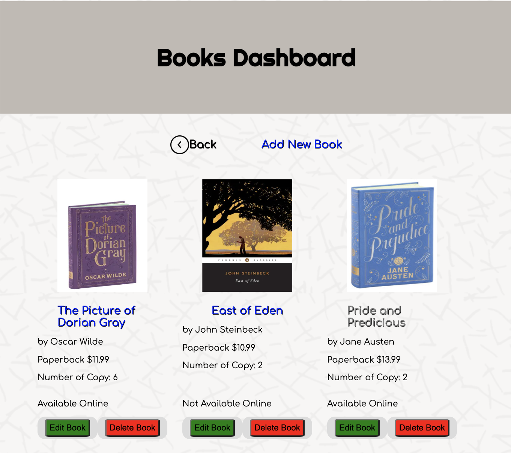
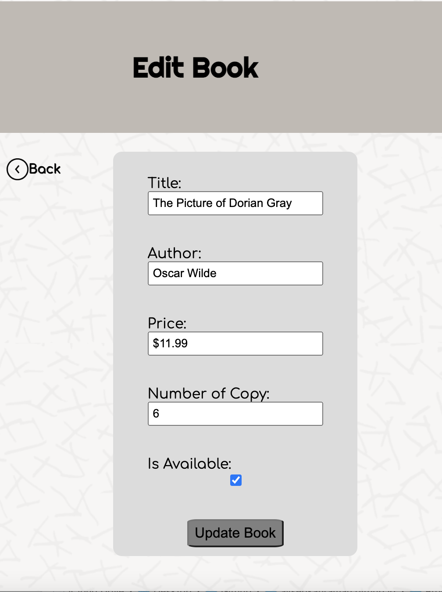
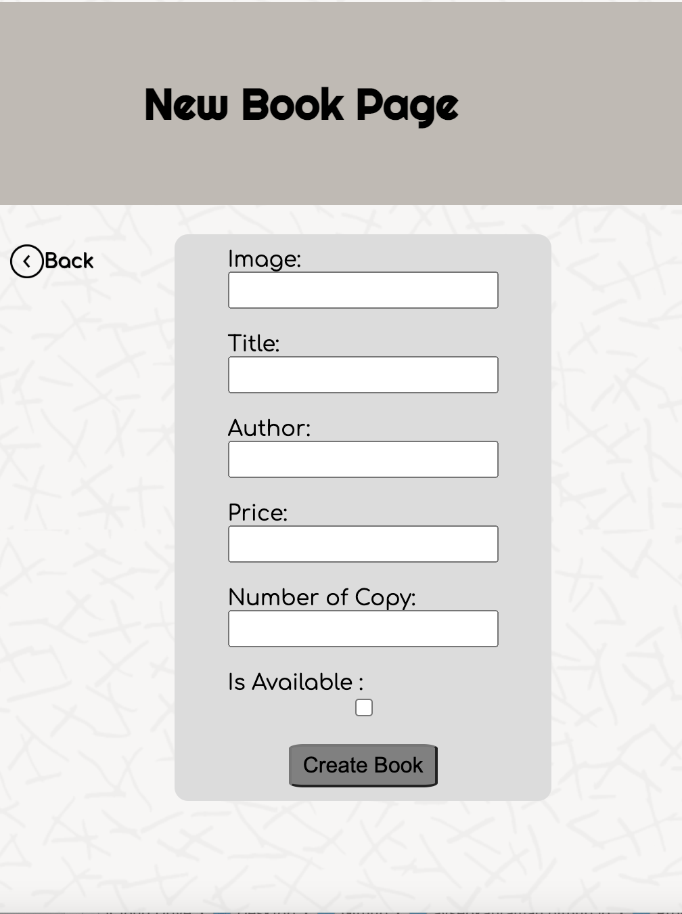

=======
__Book Store App__ =======
---
 

__Project Description__ 
---

 
Create, Read, Update and Delete are the four basic functions of persistent storage. These operations are usually referred to using the acronym CRUD. This application provides the user with the ability to ADD, DELETE, and UPDATE products. The application connected with MONGODB to fetch data.    

__Built with__
---
 
This application is created using JavaScript, HTML, and CSS.  

__Author__
---
 
Ayse Kahraman 

__Future Goals__
---
 
The future goal for this project is adding sing in and sign out pages. 