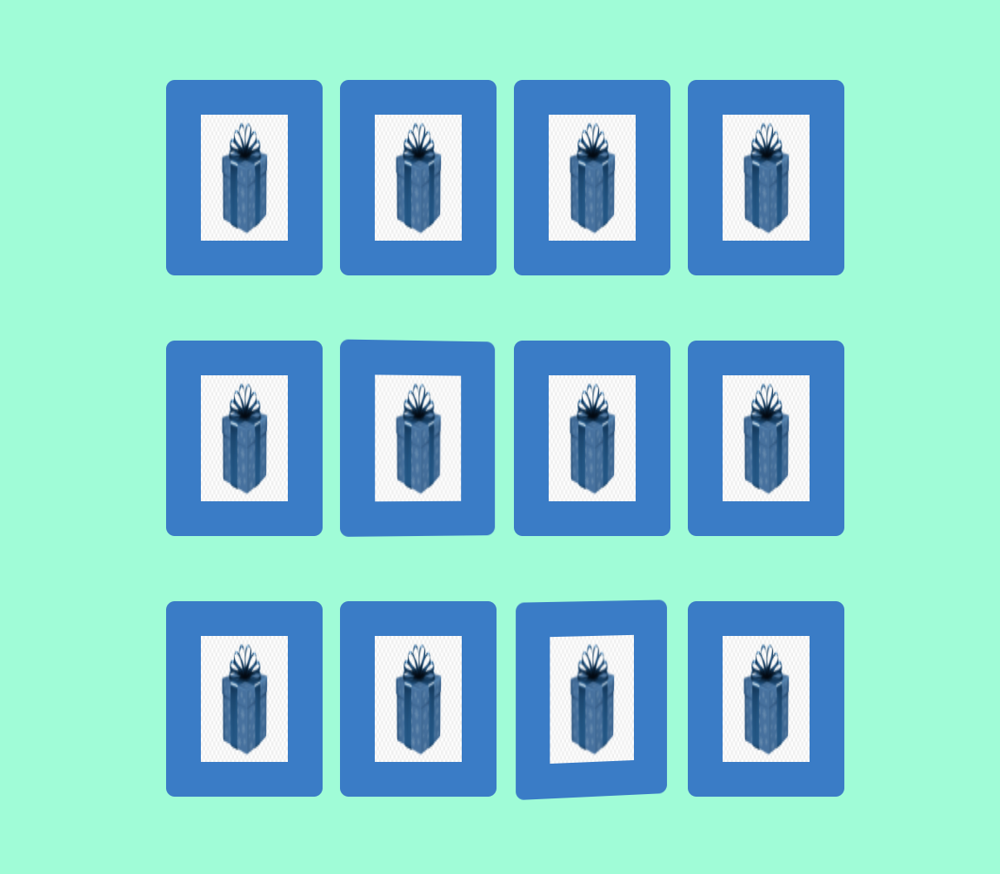
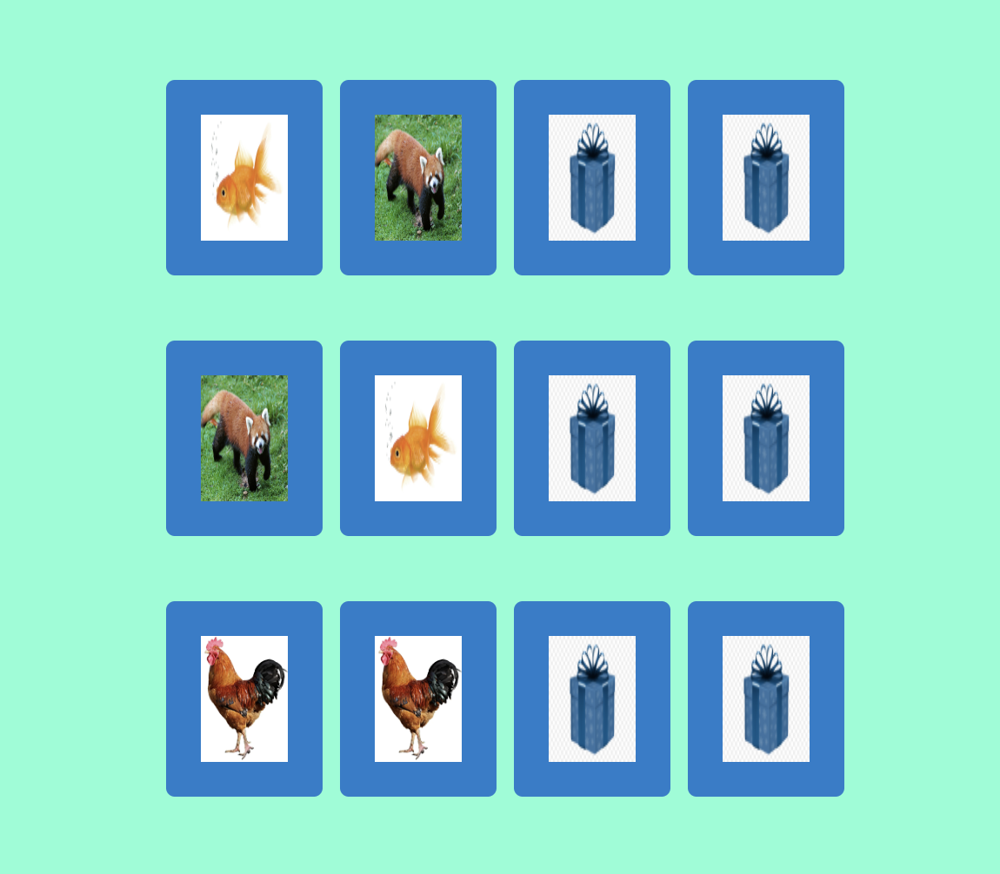

=======
__Card Game__ =======
---

__Project Description__
---
In this game, there are 12 cards. The goal is finding the matching card. Players should click the card just to see other side of the card. 

__Built with__
---
This game is created using JavaScript, HTML, and CSS.

__Author__
---
Ayse Nur Bali Kahraman

__Getting started__
---
It is a browser game that can be run any browser on any device that supports a browser.

__Future Goals__
---
Adding a counter to show how many attemp player did. 

