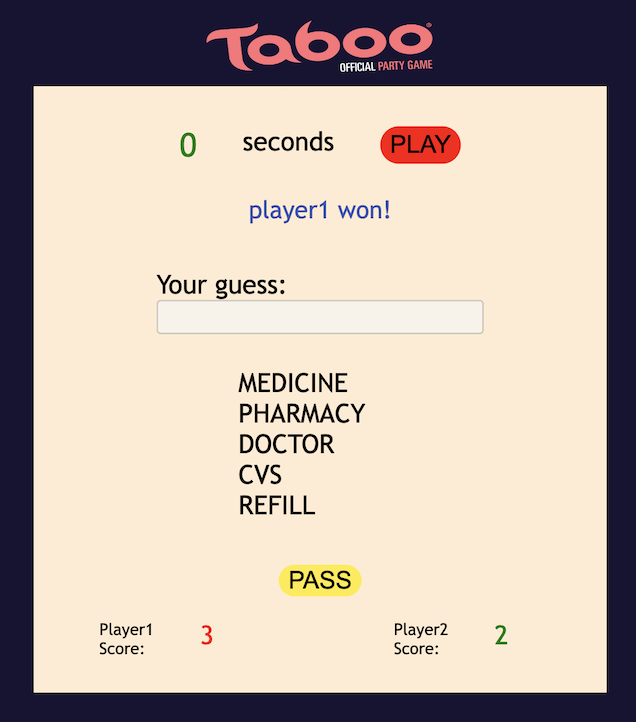

=======
__Taboo Game__
---

__Project Description__
---
It is a browser interactive game which objective is to find correct words using clue words. Each player has 60 seconds in each turn. The player who knows the most words wins the game. 

__Built with__
---
This game is created using JavaScript, HTML, and CSS.

__Author__
---
Ayse Nur Bali Kahraman

__Getting started__
---
It is a browser game that can be run any browser on any device that supports a browser.

__Game Executing & Buttons__
---
There are 2 buttons on the game:
 
*Play: this button starts the timer. Players have 60 seconds in each round. 
 
*Pass: this button give chance to move the next word if player does not know current word. 

__The End of The Game__
---
Once each player plays the game for two rounds players are informed about who is the winner. 

__Future Goals__
---
Hide the card: when time is up the next player see the word on the screen whithout timer starts even though player can only type when the timer starts. Card should be hided so that player won't see clue words before starting the timer. 

