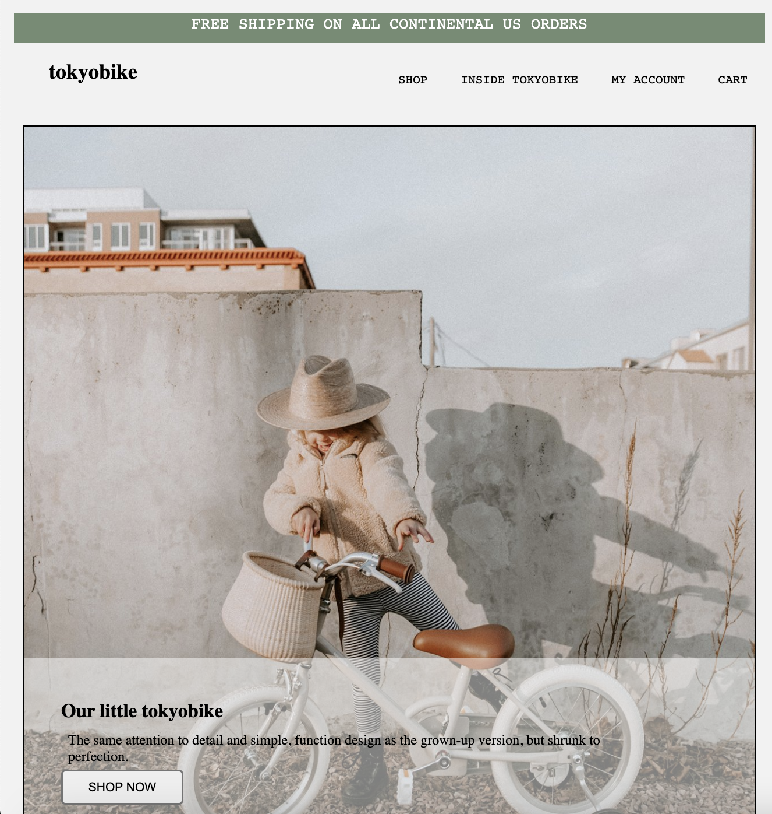
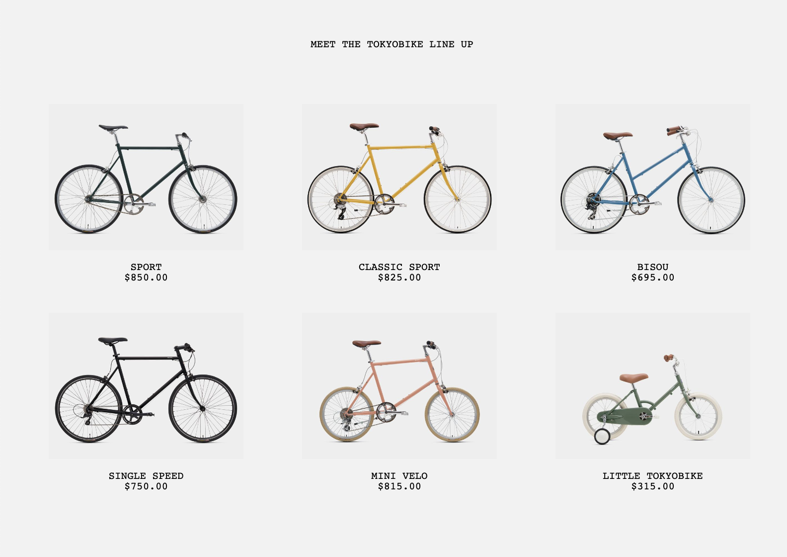
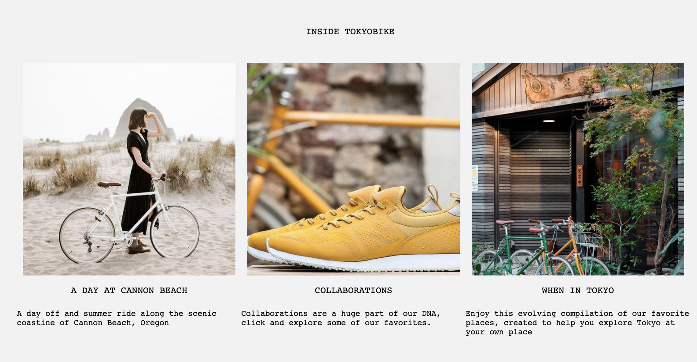

=======
__Tokyo Bike Page__ =======
---
 

__Description__ 
---

 
Cloning tokyo bike web page    

__Built with__
---
 
This application is created using HTML and CSS.  

__Author__
---
 
Ayse Kahraman 

__Future Goals__
---
 
The future goal for this project is making buttons functional 